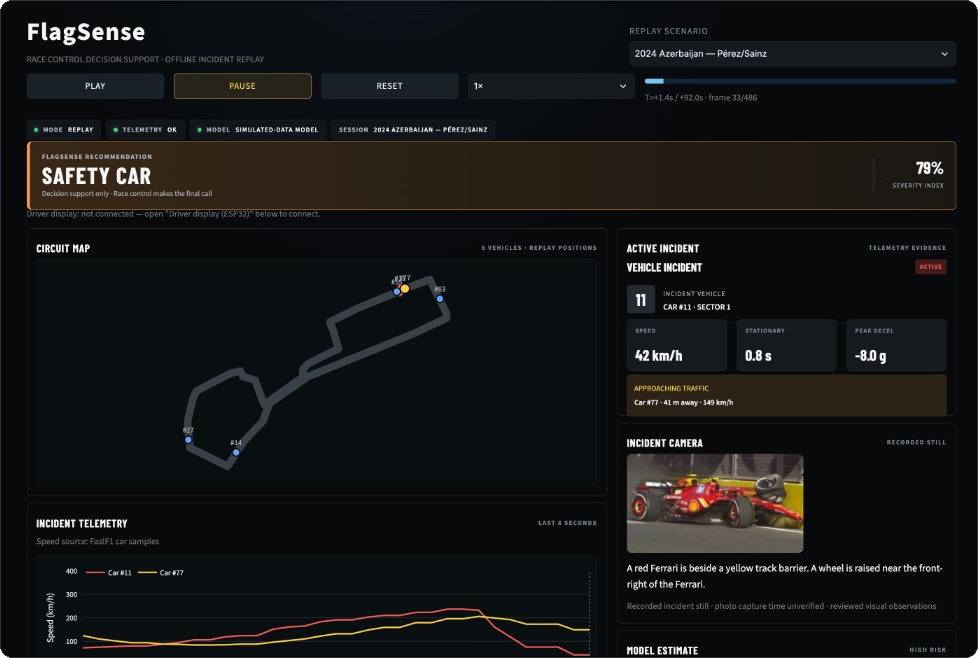
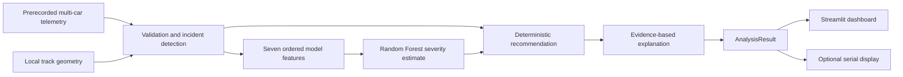

# FlagSense

FlagSense is an offline, operator-facing motorsport incident-awareness prototype. It replays multi-car telemetry, estimates incident severity, and explains a GREEN, YELLOW, or RED FLAG RECOMMENDED result to a human decision maker. It does not activate a real flag.

<p align="center">
  
</p>


## Run the demo

Use Python 3.11 or newer from the repository root:

```bash
python3 -m venv .venv
source .venv/bin/activate
python -m pip install -r requirements.txt
streamlit run app.py
```

Open the local URL printed by Streamlit and select **Start Demo**. The 20-second prerecorded race begins green. Car #12 decelerates and stops on the racing-line proxy; car #7 approaches from behind. The recommendation progresses to yellow and then Safety Car as fast traffic closes. RED needs corroborating high-consequence evidence, such as a stopped multi-car incident on a street circuit, a prolonged street-circuit blockage without runoff, a recovery vehicle in wet, poor visibility, or high-confidence visual evidence of major track blockage. **Pause**, **Reset**, and the 1×/2× selector make the sequence repeatable. The demo, track, and model files are committed, so the dashboard needs no network connection after dependencies are installed.

Select **Historical Scenario** to replay 2024 Azerbaijan Pérez/Sainz, 2021 Azerbaijan Verstappen, 2022 Canada Tsunoda, or 2024 Qatar mirror debris. The dashboard shows documented race-control actions on a separate timeline from FlagSense output. Bundled fallback motion is simulated; the optional FastF1 cache can provide measured speed samples and derived features for the two Azerbaijan cases. No live fetch occurs in Streamlit. See [historical scenario methods and sources](docs/HISTORICAL_SCENARIOS.md).

Each of those four replays includes a user-provided recorded still. At T=0, the matching photo and description appear in the compact Incident camera card while playback continues. The photos' exact capture times are not verified. A small offline caption builder joins reviewed, image-specific observations after checking that the file matches its recorded SHA-256 hash. The observations are cached visual evidence, not a trained image model or a live camera stream. Additional images need reviewed scenario observations or a configured `VisionAnalyzer` provider to add visual facts.

For one-time online preparation of measured feeds, install the optional dependency and run:

```bash
python -m pip install -r requirements-historical.txt
python scripts/fetch_historical_scenarios.py --scenario 2024_azerbaijan_perez_sainz
python scripts/fetch_historical_scenarios.py --scenario 2021_azerbaijan_verstappen
```

The prepared data is local and ignored by Git because upstream redistribution rights are not established. `python scripts/build_scenario_cache.py --scenario all` regenerates the small, portable simulated fallback files.
For a text timeline, run `python scripts/run_historical.py --scenario 2024_azerbaijan_perez_sainz`; add `--write-derived` to cache the pipeline's derived features locally.

For a terminal-only replay:

```bash
python -m scripts.run_demo
```

To regenerate the simulated inputs and retrain the model:

```bash
python -m scripts.generate_training_data
python -m scripts.train_model
python -m scripts.generate_demo_race
```

## How it works

The current demo uses prerecorded telemetry and local track geometry. Telemetry validation and incident detection produce structured facts; a Random Forest estimates severity; deterministic rules choose the recommendation and produce reasons; the dashboard renders the resulting `AnalysisResult`.



Environmental context and structured still-image evidence pass through `FusedFeatures` to explicit deterministic rules and explanations. The existing Random Forest still receives only its seven telemetry fields. Reviewed visual facts for the four supplied images are bundled; the optional image adapter has no general image-recognition provider, so an unreviewed image alone creates no visual claim. The pipeline owns the recommendation, and the dashboard and optional display consume its result. See [architecture](docs/ARCHITECTURE.md) and [data contracts](docs/DATA_CONTRACTS.md) for component boundaries and shared types.

## Repository contents

| Path | Purpose |
| --- | --- |
| `app.py` | Streamlit track, recommendation, evidence, model output, telemetry, and playback controls |
| `assets/` | Dashboard CSS styling and preview screenshot |
| `src/telemetry.py` | CSV validation, ordering, and short-gap interpolation |
| `src/track.py` | Track geometry and along-track distances |
| `src/incident_detection.py` | Rolling histories, stops, deceleration, racing-line proxy, and closing traffic |
| `src/features.py` | Seven ordered model features |
| `src/model.py` | Synthetic scenario generator, Random Forest training, inference, and deterministic fallback |
| `src/risk_engine.py` | Rules that convert evidence and model risk into a recommendation |
| `src/pipeline.py` | One-frame integration and a stable output contract |
| `src/historical.py` | Historical scenario validation, local loading, and causal replay |
| `src/sensor_fusion.py`, `src/vision.py`, `src/incident_media.py` | Typed visual facts, optional image adapter, and reviewed incident still captions |
| `src/hardware_link.py` | Serial bridge dispatching recommendations and telemetry to the driver display |
| `data/scenarios/` | Four sourced scenario manifests and simulated offline fallback files |
| `data/demo_race.csv` | Prerecorded four-car, 10 Hz, 20-second scenario |
| `data/track.json` | Closed four-sector track used by the demo |
| `models/evaluation.txt` | Holdout results on simulated data only |
| `firmware/` | Optional ESP32 display firmware and native parser test |
| `docs/` | Architecture, contracts, demo, ML, and hardware notes |

The input CSV requires `timestamp_s`, `car_id`, `x_m`, `y_m`, `speed_kmh`, `longitudinal_accel_g`, and `sector`. Positions and timestamps are numeric; `sector` is 1–4. `AnalysisResult` includes timestamp, data status, recommendation, severity, risk score, class probabilities, incident and approaching-car details, reasons, vehicle positions, and quality notes. `AnalysisResult.to_dict()` provides a plain dictionary for another display or adapter.

## Limits and next work

Thresholds in `config.py` are **prototype settings**, not official motorsport rules. The “racing line” is the centerline of the supplied synthetic track. The Random Forest was trained and evaluated only on generated examples; its holdout report does not establish real-world safety accuracy. Recommendations use deterministic gates, including a confirmed stop, so a brief deceleration alone does not change the displayed flag. If the model file is missing or incompatible, inference falls back to explicit rules and the dashboard labels that source.

The prerecorded CSV is the dependable demo input. Typed environmental fusion and a still-image adapter exist; an automated image provider and validation against real-world outcomes remain future work. A model severity score alone cannot recommend RED. Hardware integration consumes the pipeline output contract; it does not calculate risk or choose a recommendation. The serial protocol and ESP32 firmware are documented in [`FLAGSENSE_SERIAL_PROTOCOL.md`](FLAGSENSE_SERIAL_PROTOCOL.md) and [`firmware/README.md`](firmware/README.md).

FlagSense is a hackathon decision-support demonstration, not a certified motorsport safety system.
