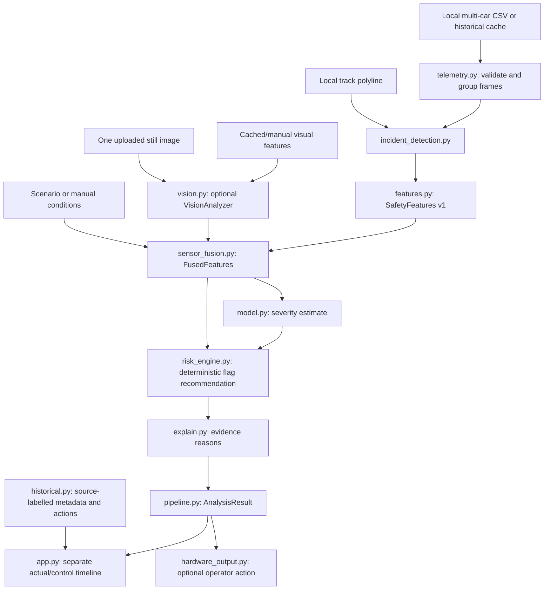
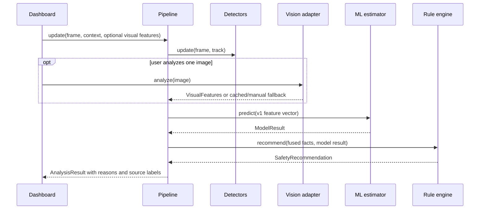

# Architecture

FlagSense is one local Python process. Its only authority is to **recommend** a flag to a human. The telemetry pipeline, dashboard, typed context/visual fusion, and optional still-image adapter exist. No automated vision provider is bundled. [Data contracts](DATA_CONTRACTS.md) give field definitions and implementation status.

## Boundaries and ownership

| Component | Input → output | Rule |
| --- | --- | --- |
| `src/telemetry.py` (exists) | CSV → validated timestamp frames | One row per car/time; reject duplicate keys and invalid values. Missing required speed is never zero-filled. |
| `src/track.py` (exists) | Local closed polyline and x/y → along-track position/offset | Use forward along-track gap for approaching traffic and start/finish wrap. |
| `src/incident_detection.py` (exists) | Frame, track, short history → `DetectedCar` facts | Detect deceleration, sustained stop, line proximity, approaching/nearby cars, multiple affected cars. It does not choose a flag. |
| `src/features.py` (exists) | `DetectedCar` → `SafetyFeatures` | Owns the fixed seven-column v1 model vector. |
| `src/vision.py` (adapter exists) | One image or configured provider → `VisualFeatures | None` | No provider is bundled. Only observable evidence; never asks for or returns a flag. |
| `src/sensor_fusion.py` (exists) | Telemetry, context, optional visual facts → `FusedFeatures` | Preserve source, missingness, and confidence. The v1 model vector remains seven telemetry values. |
| `src/model.py` (exists) | Feature vector → `ModelResult` | Random Forest estimates severity; local rules fallback is labeled. No flag decision. |
| `src/risk_engine.py` (exists) | `SafetyFeatures` or `FusedFeatures` and model result → `FlagDecision` | Sole owner of deterministic flag rules. Context guardrails are prototype logic, not FIA rules. |
| `src/explain.py` (exists) | Evidence and fired rule → ordered reasons | Derive text from actual structured values, with no LLM. |
| `src/pipeline.py` (exists) | Telemetry frame plus optional context/visual → `AnalysisResult` | One stateful facade, multi-car incident selection, data-unavailable handling. |
| `src/historical.py` (exists) | Local scenario manifest and CSV → validated replay frames | Actual control actions remain separate from pipeline input. |
| `app.py` (exists) | `AnalysisResult` and historical actions → dashboard | Playback and presentation only; no safety calculations. |
| `src/hardware_output.py` (planned) | Explicit operator action plus recommendation → serial message | No risk logic; disconnect must not interrupt software. |

## Data flow and two schema phases

**Implemented v1:** `load_telemetry(path) → list[pandas.DataFrame]`; `IncidentDetector.update(frame, track) → list[DetectedCar]`; `extract_features(car) → SafetyFeatures`; `SafetyFeatures.model_vector() → seven ordered numeric fields`; `RiskEstimator.predict(features) → ModelResult`; `recommend_flag(...) → FlagDecision`; `build_reasons(...) → list[str]`; `SafetyPipeline.update(frame) → AnalysisResult`. The current seven fields are stationary time, peak deceleration, line proximity, closing speed, closest-car distance, nearby count, and multiple-car indicator. The model artifact schema is version 1. Its risk score is `0.5 × P(MODERATE_RISK) + P(HIGH_RISK)`, a severity index rather than a real-world accident probability.

**Implemented extension:** `EnvironmentalContext` and optional `VisualFeatures` feed `FusedFeatures`; the deterministic engine reads them while the Random Forest remains v1 telemetry-only. The historical adapter passes only facts available by each replay point. Adding fields to the Random Forest remains a deliberate v2 migration requiring new training data, model artifact, tests, and contract update. Do not imply context or visual facts influenced v1 ML probabilities.

## Safety and failure behavior

The rules engine is the only place that can produce `GREEN`, `YELLOW`, or `RED_RECOMMENDED`. A stopped car on the racing line with closing traffic must be at least YELLOW; a sustained stop with close, fast traffic can trigger RED_RECOMMENDED. Thresholds live in `config.py` and are **prototype/demo values, not official FIA thresholds**. No component may claim autonomous flag control.

An unreadable model selects a visibly marked `rules_fallback`; its display values are not ML probabilities. Missing visual API access selects cached or manual evidence, marked by source. With no visual evidence, omit visual claims rather than inventing negatives. Missing/invalid telemetry produces `DATA_UNAVAILABLE`, distinct from GREEN. Hardware failure creates a UI notice without changing `AnalysisResult`. Uploaded images remain local or temporary and must not be committed.
